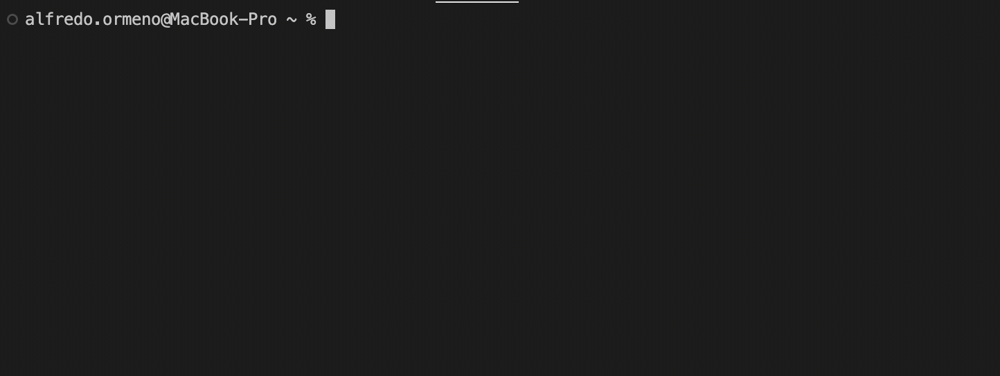

# Connect Four Game

## Overview

This is a simple implementation of the classic Connect Four game in Ruby. The game is designed to be played in a terminal or console environment.

## Demo



## Features

- Allows two players to take turns placing their game pieces on a 6x7 grid.
- The first player to connect four pieces consecutively in a row, column, or diagonal wins the game.
- Supports basic error handling for invalid moves.
- Provides a simple and enjoyable text-based gaming experience.

## Prerequisites

- Ruby 2.6 or higher.

## How to Play

1. Clone this repository to your local machine:

   ```shell
   git clone https://github.com/aao9008/Connect-Four.git

2. Navigate to project directory:
    ```shell
    cd Connect-Four

3. Run the game:
    ```shell
    ruby main.rb

4. Follow the on-screen instructions to take your turns.

## Controls
* Enter the column number (1-7) where you want to place your game piece.
* The game will display the current sate of the board after each move.

## Authors
Alfredo Ormeno Zuniga

## Acknowledgments
* Inspired by the classic Connect Four game.
